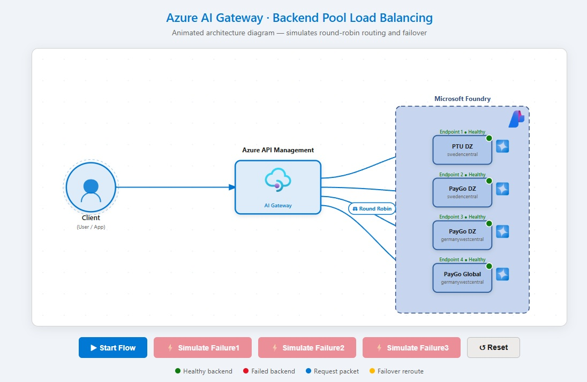
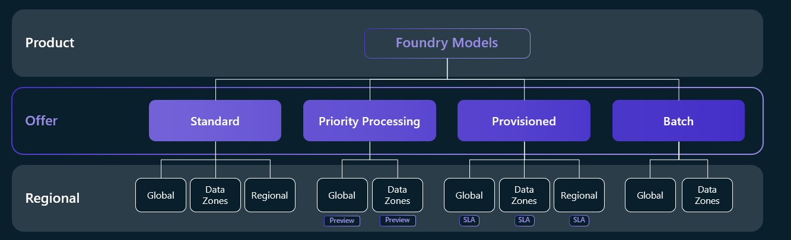

# from-specs-to-mission-critical-deployments
How to use Github spec-kit to build an AI App that'll use multiple MS Foundry Models behind Azure AI Gateway

## Why Spec-Kit?

This project uses [GitHub Spec-Kit](https://github.com/github/spec-kit) to make the development process **reproducible and AI-assisted**. Spec-Kit is a spec-driven development workflow toolkit that structures how AI agents (like Copilot) build and modify code.

### What Spec-Kit provides

| Concept | What it provides |
|---------|-----------------|
| **Constitution** | Project principles and conventions that AI agents follow |
| **Specs** | Templates for writing feature requirements |
| **Plans** | Structured implementation plans derived from specs |
| **Tasks** | Breakdowns with dependencies for execution |
| **Integrations** | Hooks into AI agents (Copilot, etc.) |

### What it solves for reusability

If someone wants to build a similar project from scratch (their own APIM + AI Foundry gateway), Spec-Kit can:

- Encode architecture decisions and conventions into **specs and a constitution**
- Guide an AI agent step-by-step through creating the Bicep, notebook, and demo artifacts
- Ensure consistency — anyone following the specs gets a similar, quality baseline

### What it does not cover

Spec-Kit is not a scaffolding or template distribution tool. It does not package artifacts into a starter kit, provide a `create-from-template` command, or handle deployment orchestration.

### Combining approaches for full reusability

| Layer | Tool |
|-------|------|
| **Development process** (how to build it) | Spec-Kit |
| **Template distribution** (clone and customize) | GitHub Template Repo, `azd init`, or Cookiecutter |
| **Deployment orchestration** (run it) | Azure Developer CLI (`azd`), or the runbook in this repo |


## Purpose of this demo 

This demo showcases how to use **Spec-Kit** to build a mission-critical deployment of Microsoft Foundry models. We deploy **4 different SKU variants** across **2 geographically distinct regions** and position them behind **Azure AI Gateway** to maximize availability and resilience.

The resulting architecture demonstrates:
- **High availability** through multi-region deployment with fallback paths
- **Cost optimization** by combining provisioned (PTU) and pay-as-you-go (PayGo) SKUs
- **Reproducibility** via Spec-Kit specs and plans that guide infrastructure-as-code generation
- **Resilience** through priority-weighted backend routing with automatic retry policies

By following the Spec-Kit workflow, teams can replicate this production-grade setup consistently.



## Architecture


The recommended architecture uses a priority-weighted backend pool. In this demo, all four endpoints use **PayGo GlobalStandard** deployments of `gpt-4o-mini`.

```
Caller (Python SDK / HTTP client)
	│
	▼
  Azure API Management (Basicv2 tier)
  ┌──────────────────────────────────────────────────────────┐
  │  Inference API  /inference/openai/...                    │
  │  Policy:                                                 │
  │    • set-backend-service → backend pool                  │
  │    • retry on 429 / 503 (count=3, tries all backends)    │
  └───────┬──────────────────────────────────────────────────┘
	  │
	  ▼
   ┌─────────────────────────────────────────────┐
   │  Backend Pool (priority + weighted routing) │
   │                                             │
   │  ┌─────────────────────────────────────┐   │
   │  │ Priority 1                          │   │  ← served first
   │  │ PTU DZ - swedencentral              │   │
   │  └─────────────────────────────────────┘   │
   │                                             │
   │  ┌──────────────────┐ ┌──────────────────┐ │
   │  │ Priority 2 w=50  │ │ Priority 2 w=50  │ │  ← 50/50 on P1 failover
   │  │ PayGo DZ         │ │ PayGo DZ         │ │
   │  │ swedencentral    │ │ germanywestcent  │ │
   │  └──────────────────┘ └──────────────────┘ │
   │                                             │
   │  ┌─────────────────────────────────────┐   │
   │  │ Priority 3                          │   │  ← last resort
   │  │ PayGo Global Germany West           │   │
   │  └─────────────────────────────────────┘   │
   └─────────────────────────────────────────────┘
```


### APIM Tiers

Azure API Management is available across several tiers — **Developer**, **Basic**, **Basicv2**, **Standard**, **Standardv2**, **Premium**, and **Consumption** — each offering a different balance of features, scalability, and cost. The classic tiers (Developer through Premium) provide a full-featured gateway with VNet integration, multi-region deployments, and built-in cache, while the v2 tiers (Basicv2, Standardv2) are a modernized offering with faster provisioning and scaling. The Consumption tier is fully serverless and billed per call, making it ideal for low-traffic or dev/test scenarios. Higher tiers unlock advanced capabilities such as availability zones, custom domains per gateway, and dedicated capacity.

For a full feature comparison, see the [Azure API Management tier features](https://learn.microsoft.com/en-us/azure/api-management/api-management-features) documentation.

### Foundry Model Offerings 

Deployment types in Azure AI Foundry define how and where your model's compute capacity is allocated:



### Table 

| Deployment type | SKU code | Data processing | Billing | Best for |
|-----------------|----------|-----------------|---------|----------|
| Standard - (PAYGO) Global | GlobalStandard | Any Azure region | Pay-per-token | General workloads, highest quota |
| Standard - (PAYGO) Data Zone | DataZoneStandard | Within data zone | Pay-per-token | EU/US data zone compliance |
| Standard - (PAYGO) Regional  | Standard | Single region | Pay-per-token | Regional compliance, low volume |
| Provisioned Global  | GlobalProvisionedManaged | Any Azure region | Reserved PTU | Predictable high-throughput |
| Provisioned Data Zone  | DataZoneProvisionedManaged | Within data zone | Reserved PTU | Data zone + predictable throughput |
| Provisioned  Regional | ProvisionedManaged | Single region | Reserved PTU | Regional compliance + throughput |
|Batch Global  | GlobalBatch | Any Azure region | 50% discount, 24-hr | Large async jobs |
| Batch Data Zone  | DataZoneBatch | Within data zone | 50% discount | Large async jobs with data zone |
| Developer | DeveloperTier | Any Azure region | Pay-per-token | Fine-tuned model evaluation only |


For more details, see the [Azure AI Foundry deployment types](https://learn.microsoft.com/en-us/azure/foundry/foundry-models/concepts/deployment-types) documentation.


In this demo, all four foundry accounts (`foundry1`–`foundry4`) deploy `gpt-4o-mini` using **`GlobalStandard`** with **8K TPM** capacity each. Combined effective capacity across all four backends = up to **32K TPM** before any 429 Errors surface to the caller — APIM exhausts all backends before returning an error.

## Notebook Setup

Use `runbook.ipynb` for the end-to-end lab flow.

Open it in VS Code:

```bash
$ code runbook.ipynb
```

### Quick start (3 steps)

1. **Run the Step 1 cell** using the default **Python 3** kernel (VS Code will prompt you to choose a kernel the first time — pick **Python 3**). This creates `.venv` and installs dependencies.
2. **Switch to the `.venv` kernel:** click the kernel picker (top-right of the notebook) and select **`.venv (Python 3.12.x)`**.
3. **Run the Step 2 verification cell** to confirm the kernel is active, then continue from Step 3.

## Kernel Troubleshooting

If `.venv (Python 3.12.x)` doesn't appear in the kernel picker:

1. Reload VS Code: `Ctrl+Shift+P` → **Developer: Reload Window**
2. Check the kernel picker again — look under *Python Environments*.
